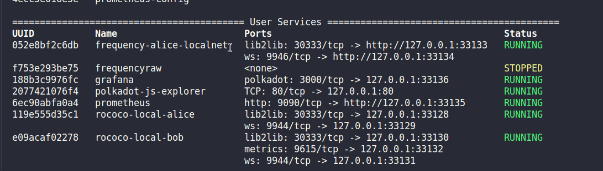
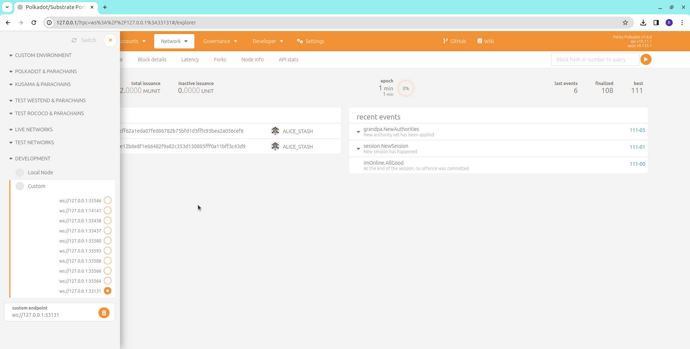

**Empower your Polkadot development with the Polkadot-kurtosis-package, an all-in-one solution for effortlessly spawning relay chains and parachains. Dive into a world of efficiency, reliability, and innovation, all meant to enhance your Polkadot experience. Welcome to the future of decentralized possibilities! Remember, the key to our existence is to distribute, decentralize, and democratize.**

[](https://discord.gg/GyRQSBN3Cu)

# Table of Contents
- [Introduction](#introduction)
  - [About](#about)
    - [Polkadot](#polkadot)
    - [Kusama](#kusama)
    - [Parachains](#parachains)
    - [Explorer](#explorer)
  - [Setup and Requirements](#setup-and-requirements)
- [Integrated Parachains Within the Polkadot-kurtosis-package](#integrated-parachains-within-the-polkadot-kurtosis-package)
  - [Overall List of Integrated Parachains](#overall-list-of-integrated-parachains)
  - [Parachains Supported in Local](#parachains-supported-in-local)
  - [Parachains Supported in Testnet](#parachains-supported-in-testnet)
  - [Parachains Supported in Mainnet](#parachains-supported-in-mainnet)
- [Configuration File Guidelines](#configuration-file-guidelines)
  - [Configuration Fields](#configuration-fields)
  - [Possible Values for Configuration Fields](#possible-values-for-configuration-fields)
  - [Example Configurations](#example-configurations)
- [Usage](#usage)
- [Service Details](#service-details)
- [Using Explorer with Service Details](#using-explorer-with-service-details)
- [Using Grafana with Service Details](#using-grafana-with-service-details)
- [Chopstick Compatibility](#chopstick-compatibility)
  - [Parachains Compatible with Chopsticks](#parachains-compatible-with-chopsticks)
  - [Configuration for Chopsticks](#configuration-for-chopsticks)
  - [Using Chopsticks](#using-chopsticks)
  - [Service Details for Chopstikcs](#service-details-for-chopstikcs)
- [Dive CLI Integration](#dive-cli-integration)
- [Known Issues](#known-issues)
- [Troubleshooting](#troubleshooting)
- [Contributing](#contributing)
- [License](#license)
- [Feedback](#feedback)

# Introduction

Polkadot-kurtosis-package is a tool built leveraging the power of Kurtosis, a developer platform for packaging and launching environments. This tool simplifies the process of setting up various local, testnet, and mainnet network configurations and scenarios for Polkadot and Kusama parachains.

## About

The primary goal of this project is to streamline the setup of Polkadot and Kusama parachain environments using the Kurtosis platform. With just a few one-liners, developers can package and launch environments tailored to their needs.

### Polkadot:

Polkadot is a blockchain platform that aims to connect different blockchains together, allowing them to communicate and share data. Imagine it as a web of interconnected blockchains, with each blockchain being an island and Polkadot being the bridges that connect them. This allows for a more seamless and efficient transfer of data and value between different blockchain networks.

You can read more about polkadot [here](https://polkadot.network/).

### Kusama:

Kusama serves as a real-world testing environment for Polkadot, a top blockchain platform designed for interoperability and scalability. Developers initially deploy and experiment with new features and upgrades on Kusama, allowing possible issues to be identified and resolved before they are implemented on the main Polkadot network. This iterative process promotes resilience and stability in the final product.

You can read more about kusama [here](https://kusama.network/).

### Parachains:

In the context of Polkadot and Kusama, a parachain is a specialized, independent blockchain that connects to the main network (also known as the Relay Chain). Each parachain is tailor-made for a specific purpose, catering to diverse applications like DeFi, gaming, or asset management. They have their own governance, consensus mechanisms, and tokens.

You can read more about parachains [here](https://wiki.polkadot.network/docs/learn-parachains). You can also see list of all the parachains on polkadot and kusama [here](https://parachains.info/).

### Explorer:

The Polkadot JS Explorer is a web-based application that serves as a comprehensive gateway to interact with and explore the Polkadot and Kusama blockchain networks. It provides a user-friendly interface for a variety of functions.

You can access the explorer [here](https://polkadot.js.org/).

## Setup and Requirements

Ensure the following prerequisites are met before using the Polkadot-kurtosis-package:
- [Docker](https://www.docker.com/): Make sure Docker is installed on your machine. You can [install it here](https://www.docker.com/).

- [Kurtosis](https://www.kurtosis.com/): Ensure Kurtosis is installed on your machine. You can [install it here](https://www.kurtosis.com/).

# Integrated Parachains Within the Polkadot-kurtosis-package

A list of all the parachains supported by the package and the environments they are available in.

## Overall List of Integrated Parachains 

<center>
<table border="1">
  <tr>
    <th>Polkadot</th>
    <th>Kusama</th>
  </tr>
  <tr>
    <td>acala</td>
    <td>altair</td>
  </tr>
  <tr>
    <td>ajuna</td>
    <td>bajun</td>
  </tr>
  <tr>
    <td>bifrost</td>
    <td>bifrost</td>
  </tr>
  <tr>
    <td>centrifuge</td>
    <td>calamari</td>
  </tr>
  <tr>
    <td>clover</td>
    <td>encointer</td>
  </tr>
  <tr>
    <td>frequency</td>
    <td>karura</td>
  </tr>
  <tr>
    <td>kilt</td>
    <td>khala</td>
  </tr>
  <tr>
    <td>kylin</td>
    <td>integritee</td>
  </tr>
  <tr>
    <td>litentry</td>
    <td>litmus</td>
  </tr>
  <tr>
    <td>manta</td>
    <td>mangata</td>
  </tr>
  <tr>
    <td>moonbeam</td>
    <td>moonriver</td>
  </tr>
  <tr>
    <td>moonsama</td>
    <td>robonomics</td>
  </tr>
  <tr>
    <td>nodle</td>
    <td>subzero</td>
  </tr>
  <tr>
    <td>parallel</td>
    <td>turing</td>
  </tr>
  <tr>
    <td>pendulum</td>
    <td></td>
  </tr>
  <tr>
    <td>phala</td>
    <td></td>
  </tr>
  <tr>
    <td>polkadex</td>
    <td></td>
  </tr>
  <tr>
    <td>subsocial</td>
    <td></td>
  </tr>
  <tr>
    <td>zeitgeist</td>
    <td></td>
  </tr>
</table>
</center>

## Parachains Supported in Local:

- **For Polkadot:** acala, ajuna, bifrost, centrifuge, clover, frequency, kilt, kylin, litentry, manta, moonbeam, moonsama, nodle, parallel, pendulum, phala, polkadex, subsocial, zeitgeist

- **For Kusama:** altair, bajun, bifrost, calamari, encointer, karura, khala, integritee, litmus, mangata, moonriver, robonomics, subzero, turing

## Parachains Supported in Testnet:

- **For Polkadot:** ajuna, bifrost, frequency, kilt, litentry, moonbeam, nodle, pendulum, phala, zeitgeist

- **For Kusama:** bajun, bifrost, encointer, integritee, mangata, moonriver, turing

- **Inactive Testnet:** karura, khala, robonomics, altair, litmus, calamari, subsocial, moonsama, manta, kylin, centrifuge, acala, polkadex, clover

- **No Testnet available:** parallel, subzero

## Parachains Supported in Mainnet:

- **For Polkadot:** acala, ajuna, bifrost, centrifuge, clover, frequency, kilt, kylin, litentry, manta, moonbeam, moonsama, nodle, parallel, pendulum, phala, polkadex, subsocial, zeitgeist

- **For Kusama:** altair, bajun, bifrost, calamari, encointer, karura, khala, integritee, litmus, mangata, moonriver, robonomics, subzero, turing

# Configuration File Guidelines

To use the Polkadot-kurtosis-package, you need to create a configuration file specifying the desired network setup. Below is an example configuration file along with explanations for each field:

```json
{
  "chain_type": "testnet",
  "relaychain": {
    "name": "rococo",
    "nodes": [
      {
        "name": "alice",
        "node_type": "validator",
        "prometheus": false
      },
      {
        "name": "bob",
        "node_type": "validator",
        "prometheus": true

      }
    ]
  },

  "parachains": [
    {
      "name":"acala",
      "nodes": [
        {
          "name": "alice",
          "node_type": "collator",
          "prometheus": false

        },
        {
          "name": "bob",
          "node_type": "full",
          "prometheus": true
        }
      ]
    }
  ],
  "explorer": true
}
```

## Configuration Fields:

- **chain_type:** Specifies the type of the network (e.g., "local","testnet", "mainnet").
- **relaychain:** Configuration for the relay chain. (When chain_type is "testnet" or "mainenet", the "relaychain" can be an empty dictonary).
  - **name:** Name of the relay chain (e.g., "rococo-local", "rococo", "polkadot" or "kusama").
  - **nodes:** List of nodes on the relay chain, each with:
    - **name:** Node name (e.g., "alice").
    - **node_type:** Node type, can be "validator" or "full".
    - **prometheus:** Whether Prometheus monitoring is enabled (true/false).
- **parachains:** List of parachains, each with:
  - **name:** Parachain name (e.g., "kilt").
  - **nodes:** List of nodes on the parachain, similar to relay chain nodes.
    - **name:** Node name (e.g., "alice").
    - **node_type:** Node type, can be "collator" or "full".
    - **prometheus:** Whether Prometheus monitoring is enabled (true/false).
- **explorer:** Whether Polkadot js explorer is enabled (true/false).

Feel free to modify this example configuration file based on your specific network requirements. [Here](./config.json) is a link to the official template that you can edit and use.

## Possible Values for Configuration Fields:

- **chain_type:** local, mainnet, testnet
- **relaychain name:** 
  - for local: rococo-local
  - for testnet: rococo, westend
  - for mainnet: polkadot, kusama
- **node_type:**
  - for relaychain: validator, full 
  - for parachain: collator, full
- **parachain name:** 
  - for polkadot: any valid parachain for polkadot from [this list](#integrated-parachains)
  - for kusama: any valid parachain for kusama from [this list](#integrated-parachains)
- **prometheus:** true or false
- **explorer:** true or false
- **node-name:** any

> **Note:** You can pass relaychain as an empty dictionary `{}` when chain_type is 'testnet' or 'mainnet'. This will only spawn the parachain. 

## Example Configurations:

Here are some example configurations you can pass to the package.

**Passing mutiple parachains without relay chain in testnet:**

```json
{
  "chain_type": "testnet",
  "relaychain": {
  },

  "parachains": [
    {
      "name":"mangata",
      "nodes": [
        {
          "name": "alice",
          "node_type": "collator",
          "prometheus": true

        },
        {
          "name": "bob",
          "node_type": "full",
          "prometheus": true
        }
      ]
    },
    {
      "name":"acala",
      "nodes": [
        {
          "name": "alice",
          "node_type": "collator",
          "prometheus": true

        },
        {
          "name": "bob",
          "node_type": "full",
          "prometheus": false
        }
      ]
    }
  ],
  "explorer": false
}
```

**Passing relay chain without parachain in mainnet:**
```json
{
  "chain_type": "mainnet",
  "relaychain": {
    "name": "rococo",
    "nodes": [
      {
        "name": "alice",
        "node_type": "validator",
        "prometheus": true
      },
      {
        "name": "bob",
        "node_type": "full",
        "prometheus": true

      }
    ]
  },

  "parachains": [
  ],
  "explorer": false
}
```

# Usage

To use the package, run the following command:

> Before proceeding, make sure the Kurtosis Engine is running in the background. If it's not already running, start it by executing the following command: `kurtosis engine start`


```bash
kurtosis run github.com/hugobyte/polkadot-kurtosis-package --enclave 'enclavename' --args-file=path/to/config/file
```

For detailed instructions on writing the configuration file, refer to the [Configuration File Guidelines](#configuration-file-guidelines).

# Service Details

Consider this sample config file:

```json
{
  "chain_type": "local",
  "relaychain": {
    "name": "rococo-local",
    "nodes": [
      {
        "name": "alice",
        "node_type": "validator",
        "prometheus": false
      },
      {
        "name": "bob",
        "node_type": "full",
        "prometheus": true

      }
    ]
  },

  "parachains": [
    {
      "name":"frequency",
      "nodes": [
        {
          "name": "alice",
          "node_type": "validator",
          "prometheus": false

        }
      ]
    }
  ],
  "explorer": true
}
```
The **service details** receieved after running the package with this config should be as follows:


You should also get the **user services** from kurtosis as follows:



The service name 'frequency-alice-local' contains the details of the 'frequency' parachain node and the service names 'rococo-local-alice' and 'rococo-local-bob' contain the details of the relay chain nodes. Each node has its own service name and service details. 

The 'polkadot-js-explorer' service contains the details of the explorer.

The 'prometheus' and 'grafana' services contain the details of required metrics.

# Using Explorer with Service Details

To use the explorer with the service details, open the given endpoint for 'polkadot-js-explorer' in the **user services**. In this case, it would be: 'http://127.0.0.1:32970'

A page like this should open:


Click on the orange icon next to unknown. This should open a side-menu. Click on Development and replace the custom endpoint port with the port of the node for which you would like to view the explorer details.

You can find the node in the **user services**. For example, consider port 32964. After passing the port in custom endpoint, your page should look like this:



# Using Grafana with Service Details

Grafana is automatically enabled when prometheus for any node is given as true. To use the grafana with the service details, open the given endpoint for 'grafana' in the **user services**. In this case, it would be: 'http://127.0.0.1:32969'

A page like this should open:


Click on Data Sources, select Prometheus. In Connection field, enter the endpoint given in 'prometheus' service in **service details**. In this case it would be 'http://172.16.0.13:9090'. Scroll down and click on *save and test*.

Now, open the side menu and click on *Dashboards*. Click on *Create Dashboard* and then *import dashboard*. Type `13759` in the *Find and import dashboards for common applications* field and click on Load. You can also use your custom dashboards here.

After loading, select prometheus from the drop down menu in the *Substrate Node* field and click on *Import*. You should now be able to see the metrics. It should look something like this:


# Chopstick Compatibility

The package also supports Chopsticks, a tool offering a user-friendly approach to locally branching existing Substrate-based chains. It enables block replay, multi-block forking, and more.

## Parachains Compatible with Chopsticks

- astar
- basilisk
- acala
- centrifuge
- composable-polkadot
- hydradx
- imbu
- interlay
- karura
- mandala
- mangata
- moonbase
- moonbeam
- moonriver
- nodle-eden
- picasso-kusama
- picasso-rococo
- polkadex
- shibuya
- shiden
- statemine
- statemint
- ß tinkernet

You can read more about Chopsticks [here](https://github.com/AcalaNetwork/chopsticks).

## Configuration for Chopsticks

```json
{
    "parachain": "acala",
    "xcm": {
        "relaychain": "polkadot",
        "parachains": [
            "acala",
            "moonbeam"
        ]
    }
}
```

- **chain:** Name of the chain to run fork of.
- **xcm:** A dict containing the following details to set up XCM multichain:
  - **relaychain:** Name of relay chain.
  - **parachains:** List of parachains.

Feel free to modify this example configuration file based on your specific network requirements. [Here](./chopsticks/chopsticks.json) is a link to the official template that you can edit and use.

## Using Chopsticks

```bash
kurtosis run github.com/hugobyte/polkadot-kurtosis-package/chopsticks --enclave 'enclavename' --args-file=path/to/config/file
```

## Service Details for Chopstikcs

The service details after running chopsticks should be similar to this:


# Dive CLI Integration

We recommend using the [Dive CLI](https://github.com/HugoByte/DIVE) developed by our company for enhanced capabilities and a seamless experience with this package. Dive CLI provides additional features that complement the functionality of this package.

To get started with Dive CLI:

1. [Download Dive CLI](https://github.com/HugoByte/DIVE)
2. Install and configure Dive CLI following the [documentation](https://github.com/HugoByte/DIVE/blob/main/README.md).

Feel free to explore the powerful features of Dive CLI alongside our package for an optimized development workflow.

## Known Issues

[Here](https://github.com/HugoByte/polkadot-kurtosis-package/issues) is a list of known issues and their status that our team is currently working to resolve. 

## Troubleshooting

If you encounter issues while using the Polkadot-kurtosis-package, refer to the following troubleshooting tips to resolve common problems:

- Clean kurtosis engine using:
```bash
kurtosis clean -a
```

- Restart kurtosis engine using:
```bash
kurtosis engine restart
```

- Check if your docker is installed:
```bash
docker --version
```

If you still experience issues after following these troubleshooting tips, please [open an issue](https://github.com/HugoByte/polkadot-kurtosis-package/issues) to get further assistance.


## Contributing

Contributions are what make the open source community such an amazing place to learn, inspire, and create. We welcome contributions to enhance and expand the functionality of the Polkadot-kurtosis-package. Any contributions you make are **greatly appreciated**.

If you have a suggestion that would make this better, please fork the repo and create a pull request.

1. Fork the Project.

2. Create your Feature Branch (`git checkout -b feature/AmazingFeature`)

3. Commit your Changes (`git commit -m 'feature message'`)

4. Push to the Branch (`git push origin feature/AmazingFeature`)

5. Open a Pull Request.

## License

Distributed under the Apache 2.0 License. See [LICENSE](./LICENSE) for more information.

## Feedback

We would happy to hear your thoughts on our project. Your feedback helps us improve and make it better for everyone. Please submit your valuable feedback [here](https://docs.google.com/forms/d/e/1FAIpQLScnesE-4IWPrFQ-W2FbRXHyQz8i_C0BVjIP_aWaxKe3myTgyw/viewform?usp=sharing)

